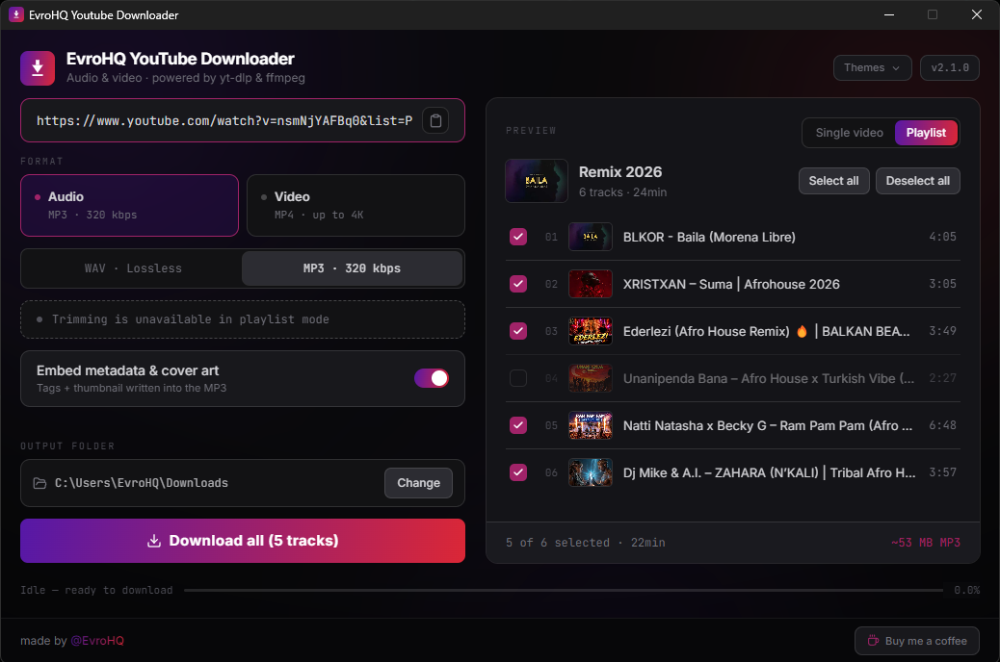
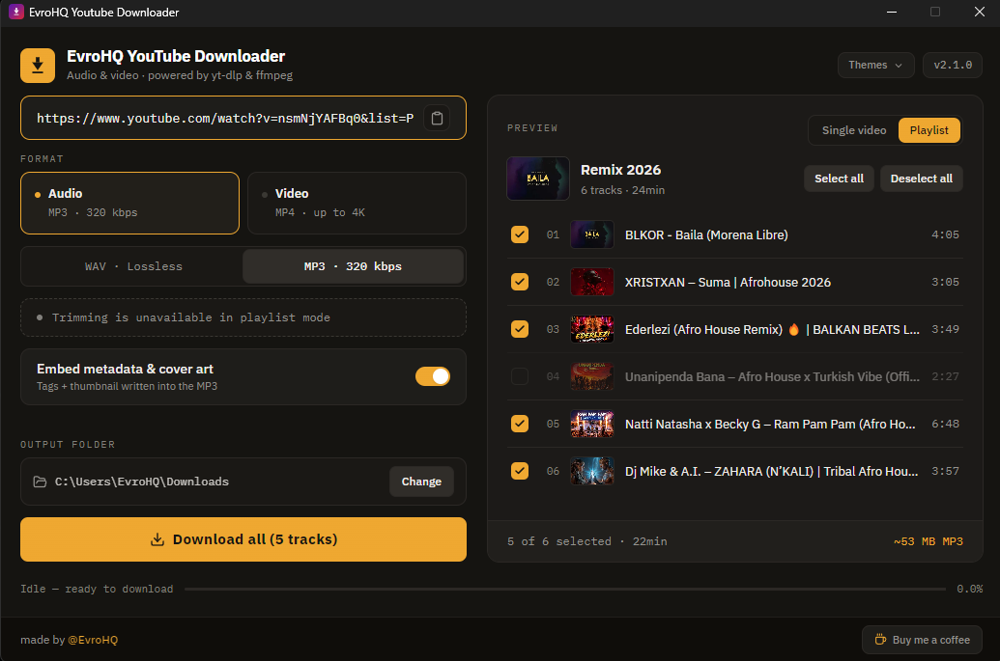
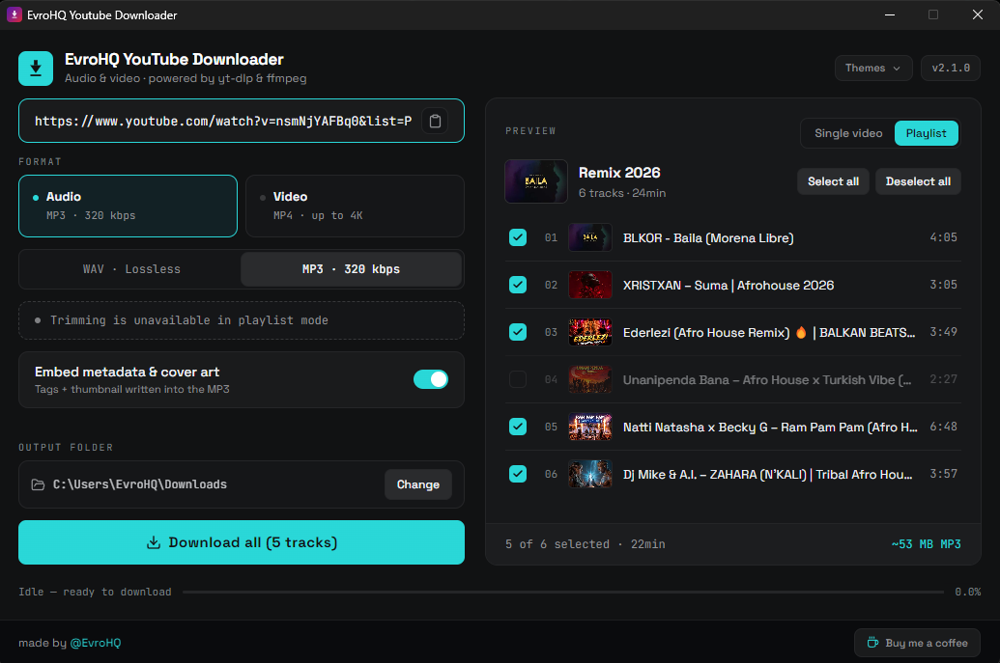
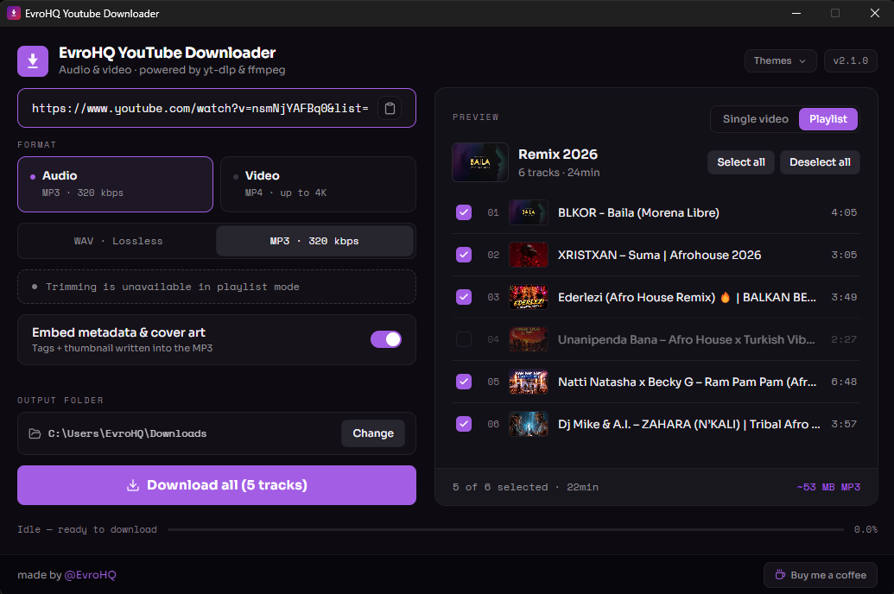
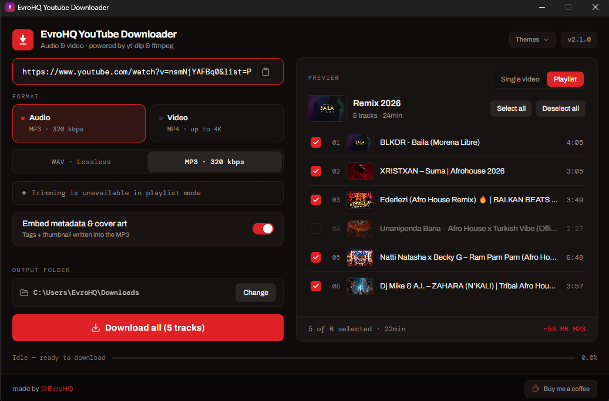
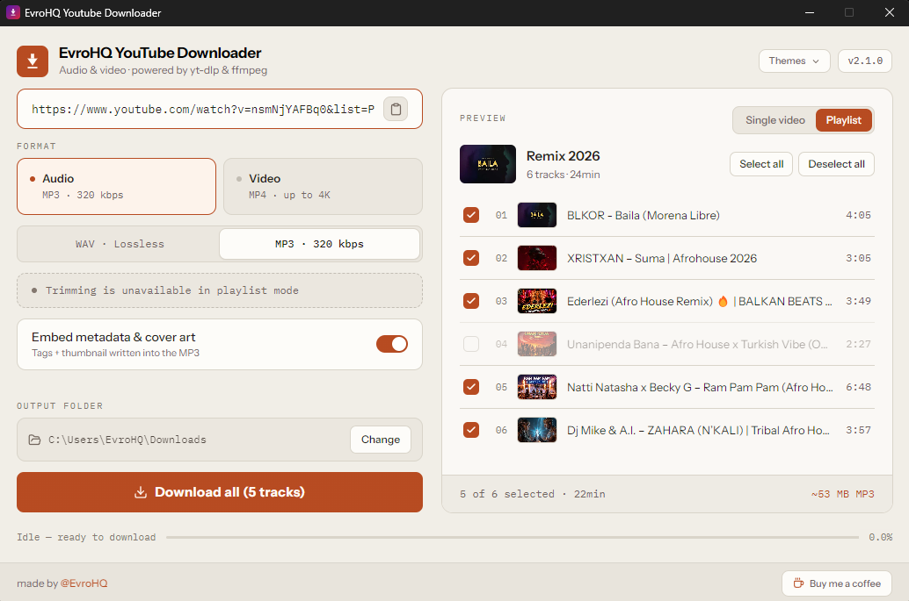
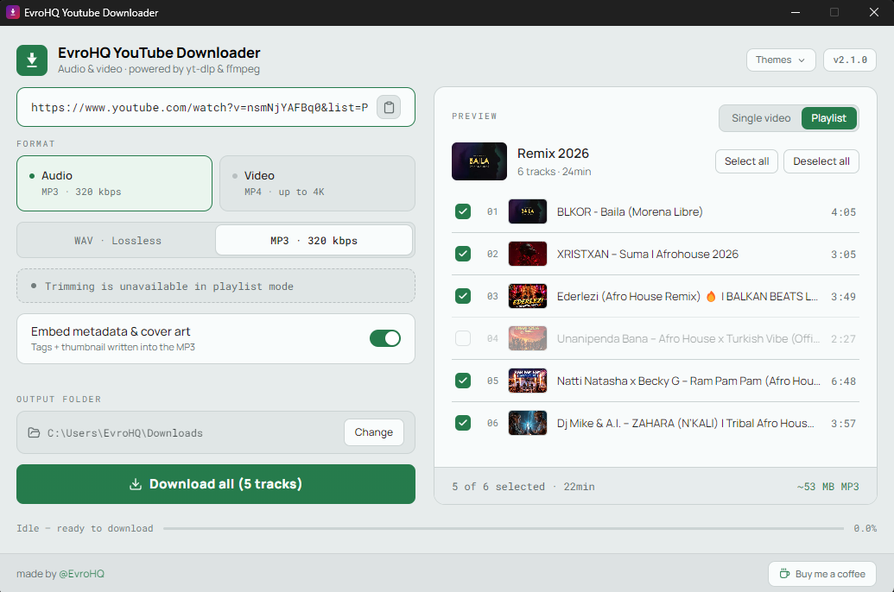

# EvroHQ YouTube Downloader

A clean, modern Windows app to download **audio** or **video** from YouTube — single videos or whole playlists.

Everything is built in — no extra tools, no terminal, no setup.

## Features

- 🎵 **Audio** — WAV (44.1 kHz, lossless) or MP3 (320 kbps)
- 🎬 **Video** — MP4 up to **1080p / 2K / 4K** (best available, sound included)
- 📋 **Playlists** — preview every track, pick the ones you want, download into a folder named after the playlist
- 🖼️ **Live preview** — thumbnail, title, channel, duration and estimated file size before you download
- ✂️ **Trim** — download only a specific time range (single videos)
- 🏷️ **Embed metadata & cover art** — write tags into audio files (cover art needs MP3)
- 🔄 **Updates** — the app and yt-dlp can update in-place so YouTube downloads keep working
- 📦 **All-in-one** — yt-dlp, ffmpeg and a tiny JS runtime are bundled; nothing else to install
- 🎨 **Themes** — seven looks (dark and light); your pick is remembered next time

## Themes

Open **Themes** in the header to switch. The last choice is restored when you reopen the app.

### Dark

| EvroHQ | Graphite & Amber |
|:---:|:---:|
|  |  |

| Carbon & Cyan | Obsidian & Violet |
|:---:|:---:|
|  |  |

| Charcoal & Signal Red |
|:---:|
|  |

### Light

| Paper & Rust | Bone & Forest |
|:---:|:---:|
|  |  |

## Download

Get the latest version from the [**Releases page**](https://github.com/EvroHQ/EvroHQ-YouTube-Downloader/releases/latest) — installer or portable, both identical in features.

---

## How to use

### Single video

1. **Paste a YouTube link** (or click **Paste**). The preview on the right fills in automatically.
2. **Choose the format**:
   - **Audio** → **WAV** (44.1 kHz, lossless) or **MP3** (320 kbps)
   - **Video** → **1080p**, **2K**, or **4K** (best quality available up to your choice; video always includes sound)
3. *(Optional)* Turn on **Trim a specific range** to grab only a portion.
   - Just type the digits — the field formats itself: typing `001030` becomes `00:10:30` (hh:mm:ss).
4. *(Optional, audio)* Leave **Embed metadata & cover art** on to write title, artist and cover into the file. Cover art is embedded for MP3 only.
5. **Choose the output folder** with **Change** (it's remembered next time). Default is your **Downloads** folder.
6. Click **DOWNLOAD**. Follow progress in the status line and the bar.
   - Need to cancel? Click **Stop**.

### Playlist

1. **Paste a playlist link.** The app switches to playlist mode and loads the track list with thumbnails.
2. **Select the tracks** you want (or use **Select all** / **Deselect all**).
3. Pick **Audio** or **Video** as usual. Trim is not available in playlist mode.
4. Click **DOWNLOAD**. Files land in a **subfolder named after the playlist**. The status line shows `Downloading 2/12` so you always know where you are.

Your files appear in the chosen folder when the log says the download finished.

---

## Good to know

- **Nothing else to install** — yt-dlp, ffmpeg and the JS runtime used for YouTube are already inside the app.
- **A video link with `&list=…`** is treated as a playlist. Switch to **Single video** in the preview if you only want that one clip.
- You need an **internet connection** to download from YouTube, of course.
- **yt-dlp updates** keep the app working when YouTube changes. When a new yt-dlp (or app) version is available, a banner appears at the top — the rest of the UI is locked until you update.
- **Antivirus false positives**: some antivirus software flags download tools. The app is safe; if needed, allow it in your antivirus.
- Downloading copyrighted content may be against YouTube's Terms of Service — use responsibly and only for content you have the right to download.

---

## Support

If this app is useful to you, you can support its development: [**☕ Buy me a coffee**](https://buymeacoffee.com/evrohq). Thank you!

---

## Credits

Made by [@EvroHQ](https://github.com/EvroHQ). Powered by [yt-dlp](https://github.com/yt-dlp/yt-dlp) and [ffmpeg](https://ffmpeg.org/).

Developers: see [BUILDING.md](BUILDING.md) to build from source.

## License

MIT
