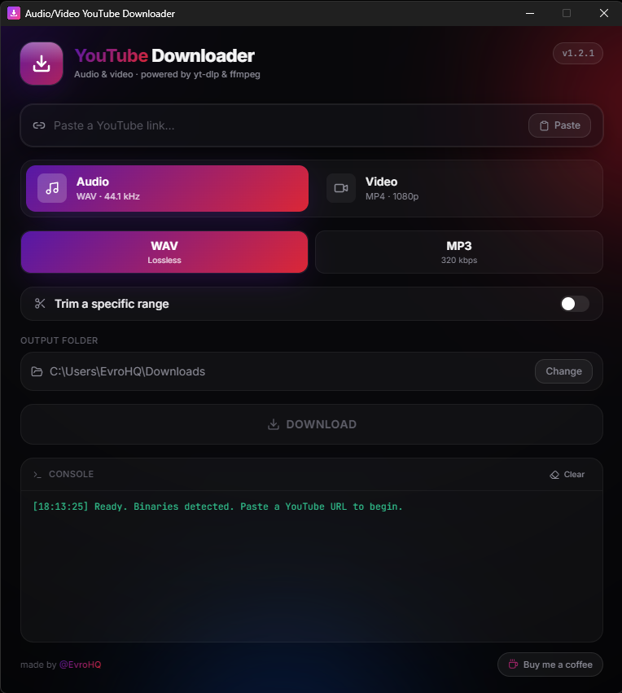

# Audio/Video YouTube Downloader

A simple, modern Windows app to download **audio** or **video** from a YouTube link — with optional trimming and per-chapter splitting.

Everything is built in — no extra tools, no terminal, no setup.

## Features

- 🎵 **Audio** export — WAV (44.1 kHz, lossless) or MP3 (320 kbps)
- 🎬 **Video** export — MP4 up to **1080p / 2K / 4K** (best available, sound included)
- ✂️ **Trim** — download only a specific time range
- 🔖 **Split by chapters** — if a video has chapters, save each one as its own file in a single run
- 🔗 **Smart links** — playlist/mix links are auto-trimmed to the single video
- 📦 **All-in-one** — yt-dlp and ffmpeg are bundled; nothing else to install

## Download

Get the latest version from the [**Releases page**](https://github.com/EvroHQ/Audio-Video-YouTube-Downloader/releases/latest) — installer or portable, both identical in features.

---

## How to use

1. **Paste a YouTube link** into the field (or click **Paste**). The border turns green when the link is valid.
2. **Choose the format**:
   - **Audio** → **WAV** (44.1 kHz, lossless) or **MP3** (320 kbps)
   - **Video** → **1080p**, **2K**, or **4K** (it takes the best quality available up to your choice; video always includes sound)
3. *(Optional)* Turn on **“Trim a specific range”** to grab only a portion.
   - Just type the digits — the field formats itself: typing `001030` becomes `00:10:30` (hh:mm:ss).
4. *(Optional)* If the video has chapters, turn on **“Split by chapters”** to save each chapter as its own file, all in one run. They land in a subfolder named after the video. *(Trim and chapter split are mutually exclusive.)*
5. **Choose the output folder** with **Change** (it's remembered next time). By default it's your **Downloads** folder.
6. Click **DOWNLOAD**. You can follow progress in the log and the progress bar.
   - Need to cancel? Click **Stop**.

Your file appears in the chosen folder when the log says the download finished.

---

## Good to know

- **Nothing else to install** — the tools that do the work (yt-dlp and ffmpeg) are already inside the app.
- **Paste anything** — links copied from a playlist or mix (`…&list=…`) are automatically cleaned to the single video.
- You need an **internet connection** to download from YouTube, of course.
- **Antivirus false positives**: some antivirus software flags download tools. The app is safe; if needed, allow it in your antivirus.
- Downloading copyrighted content may be against YouTube's Terms of Service — use responsibly and only for content you have the right to download.

---

## Support

If this app is useful to you, you can support its development: [**☕ Buy me a coffee**](https://buymeacoffee.com/evrohq). Thank you!

---

## Credits

Made by [@EvroHQ](https://github.com/EvroHQ). Powered by [yt-dlp](https://github.com/yt-dlp/yt-dlp) and [ffmpeg](https://ffmpeg.org/).

Developers: see [BUILDING.md](BUILDING.md) to build from source.

## License

MIT
